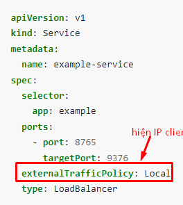

Introduce

Note dùng để tóm tắt kinh nghiệm devops

* Những helm chart thường sử dụng (Fluentbit, grafana, prometheus)
* Command thường dùng trong linux
* Kinh nghiệm xương máu


## Argocd set webhook for git
- set secret for argocd for bitbucket,git,...
```
  secret:
    ## @param config.secret.create Whether to create or not the secret
    ##
    create: true
    ## Annotations to be added to argocd-secret
    ## @param config.secret.annotations General secret extra annotations
    ##
    annotations: {}

    ## Webhook Configs
    ## @param config.secret.githubSecret GitHub secret to configure webhooks
    ## @param config.secret.gitlabSecret GitLab secret to configure webhooks
    ## @param config.secret.bitbucketServerSecret BitBucket secret to configure webhooks
    ## @param config.secret.bitbucketUUID BitBucket UUID to configure webhooks
    ## @param config.secret.gogsSecret Gogs secret to configure webhooks
    ##
    githubSecret: ""
    gitlabSecret: ""
    bitbucketServerSecret: "" -> secret
    bitbucketUUID: ""
    gogsSecret: ""

```
- config webhook for repo bitbucket https://<argocd.url>/api/websocket and secret. Remember click checkbox **active** to sync.
## RBAC Kubernetes
```
apiVersion: v1
kind: ServiceAccount
metadata:
  name: wap-developer
  namespace: s23dajinswap-dev
---
apiVersion: v1
kind: Secret
metadata:
  name: wap-developer-token
  namespace: s23dajinswap-dev
  annotations:
    kubernetes.io/service-account.name: wap-developer
type: kubernetes.io/service-account-token
---
kind: ClusterRole
apiVersion: rbac.authorization.k8s.io/v1
metadata:
  name: banca-clusterrole
  namespace: s23dajinswap-dev
rules:
- apiGroups: [""]
  resources: ["pods"]
  verbs: ["list", "get", "watch"]
- apiGroups: ["apps"]
  resources: ["deployments"]
  verbs: ["get","list", "watch"]
- apiGroups: ["apps"]
  resources: ["deployments/scale"]
  verbs: ["update"]
- apiGroups: [""]
  resources: ["services"]
  verbs: ["get","list"]
---
apiVersion: rbac.authorization.k8s.io/v1
kind: Role
metadata:
  namespace: s23dajinswap-dev
  name: wap-dev
rules:
- apiGroups: ["*"]
  resources: ["*"]
  verbs: ["*"]
---
kind: ClusterRoleBinding
apiVersion: rbac.authorization.k8s.io/v1
metadata:
  name: banca-clusterrolebinding
subjects:
- kind: ServiceAccount
  name: wap-developer
  namespace: s23dajinswap-dev
roleRef:
  kind: ClusterRole
  name: banca-clusterrole
  apiGroup: rbac.authorization.k8s.io

---
apiVersion: rbac.authorization.k8s.io/v1
# This role binding allows "jane" to read pods in the "default" namespace.
# You need to already have a Role named "pod-reader" in that namespace.
kind: RoleBinding
metadata:
  name: read-pods
  namespace: default
subjects:
# You can specify more than one "subject"
- kind: User
  name: jane # "name" is case sensitive
  apiGroup: rbac.authorization.k8s.io
roleRef:
  # "roleRef" specifies the binding to a Role / ClusterRole
  kind: Role #this must be Role or ClusterRole
  name: pod-reader # this must match the name of the Role or ClusterRole you wish to bind to
  apiGroup: rbac.authorization.k8s.io

```


# GCE Controller
- service for ingress type: NodePort
- ingress form
```
apiVersion: networking.k8s.io/v1
kind: Ingress
metadata:
  name: ingress-production
  annotations:
    kubernetes.io/ingress.class: gce
    kubernetes.io/ingress.global-static-ip-name: xeca-production
    networking.gke.io/managed-certificates: websocket-cm ,superadmin-cm, apigateway-cm , vamminh-cm, vinhquang-cm,logging-cm, vinhquang
    networking.gke.io/v1beta1.FrontendConfig: http-to-https
  namespace: s22nbaeqxeca-production
spec:
  rules:
  - host: superadmin.xeca.vn
    http:
      paths:
      - pathType: Prefix
        path: /
        backend:
          service:
            name: xeca-admin-service-production-svc
            port: 
              number: 81
  - host: api-pro.xeca.vn
    http:
      paths:
      - pathType: Prefix
        path: /
        backend:
          service:
            name: apigw-service-production-svc
            port: 
              number: 8080
  - host: logging.xeca.vn
    http:
      paths:
      - pathType: Prefix
        path: /
        backend:
          service:
            name: grafana
            port: 
              number: 3000
  - host: websocket.xeca.vn
    http:
      paths:
      - pathType: Prefix
        path: "/ticket-socket"
        backend:
          service:
            name: ticket-service-production-svc
            port: 
              number: 3003
      - pathType: Prefix
        path: "/notification-socket"
        backend:
          service:
            name: notification-service-production-svc
            port: 
              number: 3007
```
- Certmanager for ingress
```

apiVersion: networking.gke.io/v1
kind: ManagedCertificate
metadata:
  name: superadmin-cm
  namespace: s22nbaeqxeca-production
spec:
  domains:
    - superadmin.xeca.vn
---
apiVersion: networking.gke.io/v1
kind: ManagedCertificate
metadata:
  name: apigateway-cm
  namespace: s22nbaeqxeca-production
spec:
  domains:
    - api-pro.xeca.vn
---

apiVersion: networking.gke.io/v1
kind: ManagedCertificate
metadata:
  name: websocket-cm
  namespace: s22nbaeqxeca-production
spec:
  domains:
    - websocket.xeca.vn
---
apiVersion: networking.gke.io/v1
kind: ManagedCertificate
metadata:
  name: logging-cm
  namespace: s22nbaeqxeca-production
spec:
  domains:
    - logging.xeca.vn
    
```
- Backend config use for config healthcheck, websocket (Timeout),...
```
apiVersion: cloud.google.com/v1
kind: BackendConfig
metadata:
  name: web-config-backend
  namespace: s22nbaeqxeca-production
spec:
  # timeoutSec: 1800
  # connectionDraining:
  #   drainingTimeoutSec: 1800
  healthCheck:
    checkIntervalSec: 10
    timeoutSec: 5
    healthyThreshold: 1
    unhealthyThreshold: 2
    type: HTTP
    requestPath: /actuator/health
    port: 32153
---
apiVersion: cloud.google.com/v1
kind: BackendConfig
metadata:
  name: web-config-backend
  namespace: kube-system
spec:
  # timeoutSec: 1800
  # connectionDraining:
  #   drainingTimeoutSec: 1800
  healthCheck:
    checkIntervalSec: 10
    timeoutSec: 5
    healthyThreshold: 1
    unhealthyThreshold: 2
    type: HTTP
    requestPath: /healthz
    port: 30263
--- 
apiVersion: cloud.google.com/v1
kind: BackendConfig
metadata:
  name: xecaadmin-backend
  namespace: s22nbaeqxeca-production
spec:

  healthCheck:
    checkIntervalSec: 10
    timeoutSec: 5
    healthyThreshold: 1
    unhealthyThreshold: 2
    type: HTTP
    requestPath: /actuator/health
    port: 31257
---
apiVersion: cloud.google.com/v1
kind: BackendConfig
metadata:
  name: ticket-config-backend
  namespace: s22nbaeqxeca-production
spec:
  cdn:
    enabled: true
    cachePolicy:
      includeHost: false
      includeProtocol: true
      includeQueryString: false
  sessionAffinity:
    affinityType: "GENERATED_COOKIE"
    affinityCookieTtlSec: 50
  timeoutSec: 1800
  connectionDraining:
    drainingTimeoutSec: 1800
  healthCheck:
    checkIntervalSec: 10
    timeoutSec: 5
    healthyThreshold: 1
    unhealthyThreshold: 2
    type: HTTP
    requestPath: /__healthcheck
    port: 31927
---
apiVersion: cloud.google.com/v1
kind: BackendConfig
metadata:
  name: notify-config-backend
  namespace: s22nbaeqxeca-production
spec:
  cdn:
    enabled: true
    cachePolicy:
      includeHost: false
      includeProtocol: true
      includeQueryString: false
  sessionAffinity:
    affinityType: "GENERATED_COOKIE"
    affinityCookieTtlSec: 50
  timeoutSec: 1800
  connectionDraining:
    drainingTimeoutSec: 1800
  healthCheck:
    checkIntervalSec: 10
    timeoutSec: 5
    healthyThreshold: 1
    unhealthyThreshold: 2
    type: HTTP
    requestPath: /__healthcheck
    port: 31211

```
***
**Note: create External Ip for load balancer first**
## HTTP Security Headers
- HTTP Strict Transport Security (HSTS): kết nối an toàn web, server  buộc là phải giao tiếp https, max age:  thời gian truy cập https, IncludeSubDomains : cấu hình cho subdomain
  ```
  Strict-Transport-Security: max-age=31536000; includeSubDomains; preload
  ```
- Content Security Policy (CSP): Hạn chế tài nguyên mà người dùng được phép tải trên website
  ```
  Content-Security-Policy: <policy-directive>; <policy-directive>
  Content-Security-Policy: script-src 'self' https://viblo.asia
  //chỉ cho phép tải qua website https://viblo.asia
  ```
- Cross Site Scripting Protection (X-XSS): bảo vệ các cuộc tấn công XSS có 4 chế độ

  - 0: Bộ lọc XSS bị vô hiệu hóa.

  - 1: Bộ lọc XSS được kích hoạt và bảo vệ trang nếu phát hiện tấn công.

  - 1;mode=block: Bộ lọc XSS được kích hoạt và ngăn chặn hiển thị trang nếu phát hiện tấn công.

  - 1;report=https://viblo.asia: Bộ lọc XSS được kích hoạt và báo cáo vi phạm nếu phát hiện cuộc tấn công.
  ```
  X-XSS-Protection: 0
  X-XSS-Protection: 1
  X-XSS-Protection: 1; mode=block
  X-XSS-Protection: 1; report=<reporting-uri>
  ```
- X-Frame-Options:
  - Kĩ thuật giả mạo Clickjacking là lừa người dùng click thứ gì đó không có ở trong website
  - Option này ngăn chặn hoặc vô hiệu hóa iframe có trên website
  - có 3 options: SAMEORIGIN: chỉ cho phép từ nguồn gốc, DENY: Ngăn chặn bất kì các tên miền nào, ALLOW-FROM: chỉ cho phép từ URI cụ thể
  ```
  X-Frame-Options: DENY
  X-Frame-Options: SAMEORIGIN
  X-Frame-Options: ALLOW-FROM https://viblo.asia
  ```
  ## Turn off version nginx
  add this option in config server of nginx
  ```
  server_tokens off;
  ```
## KANIKO
```
  https://github.com/GoogleContainerTools/kaniko
```
## NGINX
- ssh root@10.0.0.12 -i id_rsa_orgin
## K8S pull image from artifact registry
- create secret
```
kubectl -n b22dadtubac-prod-gcp create secret docker-registry regcred-repo-edsolabs \
--docker-server=https://asia-southeast1-docker.pkg.dev \
--docker-email=artifact-cleo-prod@cleo-prod.iam.gserviceaccount.com \
--docker-username=_json_key \
--docker-password="$(cat cleo-prod-b508617b9167.json)"
```
- add secret to image pull secret 
## Intergrate keyvault with aks
- turn on identity virtual machine scale set
- Keyvault: Access controll (IAM) ->  add resource assigament -> choose role -> add member (assign managed identity)
- enable addons azure-keyvault
```
az aks enable-addons --addons azure-keyvault-secrets-provider --name aksdemocluster --resource-group aksdemocluster-rg
```
- create secretproviderclass
```
apiVersion: secrets-store.csi.x-k8s.io/v1
kind: SecretProviderClass
metadata:
  name: azure-kvname-system-msi
spec:
  provider: azure
  parameters:
    usePodIdentity: "false"
    useVMManagedIdentity: "true"    # Set to true for using managed identity
    userAssignedIdentityID: ""      # If empty, then defaults to use the system assigned identity on the VM
    keyvaultName: aksdemocluster-kv
    cloudName: "AzurePublicCloud"                   # [OPTIONAL for Azure] if not provided, the Azure environment defaults to AzurePublicCloud
    objects:  |
      array:
        - |
          objectName: dev2-*
          objectType: secret        # object types: secret, key, or cert
          objectVersion: ""         # [OPTIONAL] object versions, default to latest if empty
    tenantId: e276db94-bd4f-4502-b458-b1c6fcefdcf2          # The tenant ID of the key vault
```
```
apiVersion: secrets-store.csi.x-k8s.io/v1
kind: SecretProviderClass
metadata:
  name: azure-sync
  namespace: b22dadtubac-dev-cloud
spec:
  provider: azure  
  parameters:
    usePodIdentity: "false"
    useVMManagedIdentity: "true"         
    userAssignedIdentityID: ""   
    keyvaultName: "CleoVaultDev" 
    tenantId: e276db94-bd4f-4502-b458-b1c6fcefdcf2 
    objects:  |
      array:k apply 
        - |
          objectName: dev2-BCWORKER-AM-BASE-URL-VAULT
          objectType: secret
        - |
          objectName: dev2-BCWORKER-AZURE-SERVICE-BUS-CONNECTION-STRING
          objectType: secret                                 
  secretObjects:                              # [OPTIONAL] SecretObjects defines the desired state of synced Kubernetes secret objects
  - data:
    - key: urlvault                           # data field to populate
      objectName: dev2-BCWORKER-AM-BASE-URL-VAULT                        # name of the mounted content to sync; this could be the object name or the object 
    secretName: bcworker                     # name of the Kubernetes secret object
    type: Opaque 
```
- Create Pod use Secret
```

kind: Pod
apiVersion: v1
metadata:
  name: busybox-secrets-store-inline-system-msi
spec:
  containers:
    - name: busybox
      image: k8s.gcr.io/e2e-test-images/busybox:1.29-1
      command:
        - "/bin/sleep"
        - "10000"
      volumeMounts:
      - name: secrets-store01-inline
        mountPath: "/mnt/secrets-store"
        readOnly: true
  volumes:
    - name: secrets-store01-inline
      csi:
        driver: secrets-store.csi.k8s.io
        readOnly: true
        volumeAttributes:
          secretProviderClass: "azure-kvname-system-msi"
```
```
kind: Pod
apiVersion: v1
metadata:
  name: secret-pod
  namespace: b22dadtubac-dev-cloud
spec:
  containers:
    - name: busybox
      image: k8s.gcr.io/e2e-test-images/busybox:1.29-1
      command:
        - "/bin/sleep"
        - "10000"
      env:
      - name: SECRET_USERNAME
        valueFrom:
          secretKeyRef:
            name: bcworker
            key: urlvault
```
## ENJECT VAULT AGENT POD K8S
- step 1: Authen and get issuer by command
```
- kubectl get --raw /.well-known/openid-configuration
- vault auth enable kubernetes

- vault write auth/kubernetes/config \
  token_reviewer_jwt="$(TOKEN_SERVICE_ACCOUNT)" \
  kubernetes_host=https://${KUBERNETES_PORT_443_TCP_ADDR}:443 \
  kubernetes_ca_cert=@/var/run/secrets/kubernetes.io/serviceaccount/ca.crt \
  issuer="https://cleodevcluster-dns-wv0ej0np.hcp.southeastasia.azmk8s.io"
```

- step 2: create path and  create policy
```
vault secrets enable -path=cleo/dev2 kv

vault policy write cleo-dev2 - << EOF
path "cleo/dev2/*" {
  capabilities = ["read", "update", "list"]
}
EOF

vault kv put cleo/dev2/store username=cleo-admin pass=sdfasdsd2132
```
- step 3: create role
```
vault write auth/kubernetes/role/cleo-dev2 \
    bound_service_account_names=vault-dev \
    bound_service_account_namespaces=b22dadtubac-dev-cloud \
    policies=cleo-dev2 \
    ttl=30h
```
- step 4: create token from policy
```
vault token create -policy=cleo-dev2 -period=768h
```
- step 5: inject vault agent to pod
```
apiVersion: v1
kind: Pod
metadata:
  name: ubuntu3
  namespace: b22dadtubac-dev-cloud
  annotations:
    vault.hashicorp.com/agent-inject: 'true'
    vault.hashicorp.com/agent-inject-secret-.env: cleo/dev2/store
    vault.hashicorp.com/agent-inject-template-.env: |
      {{- with secret "cleo/dev2/store" -}}
      {{ range $k, $v := .Data.data }}
      {{ $k }}="{{ $v | printf "%s" }}"
      {{ end }}
      {{- end -}}    
    vault.hashicorp.com/role: cleo-dev2
    vault.hashicorp.com/auth-path: auth/kubernetes
spec:
  serviceAccountName: vault-dev
  containers:
  - name: ubuntu
    image: ubuntu
    command:
    - sleep
    - infinity
    resources:
      limits:
        memory: "128Mi"
        cpu: "200m" 
```
## COMMON COMAND
- Out of RAM
```
sync; echo 1 > /proc/sys/vm/drop_caches
```
## SERVICE
`Preserving the client source IP`
- Mặc dịnh target container sẽ không nhìn thấy ip gốc client. .spec.externalTrafficPolicy= Cluster (default)
- 

## Add role permission for keyvault step by step
- step 1: go to resource that want to grant role access keyvault
- step 2: go to security > indetity > system asssigned > turn on
- step 3: go to keyvaul > IAM > add role assigment > choose permistion >  manage identity > select member
** reference: https://learn.microsoft.com/en-us/azure/app-service/overview-managed-identity?tabs=portal%2Chttp
## RPS (request per second)
- RPS = number CPU*(1/ task duration) (time xử lý 1 request) = (total ram/ ram usage)8(1/task duration)
## Settup Mysql Server
- install reference https://www.digitalocean.com/community/tutorials/how-to-install-mysql-on-ubuntu-22-04
```
sudo apt update
sudo apt install mysql-server
sudo systemctl start mysql.service
```
```
ALTER USER 'root'@'localhost' IDENTIFIED WITH mysql_native_password BY 'password';
exit
sudo mysql_secure_installation
ALTER USER 'root'@'localhost' IDENTIFIED WITH auth_socket;
```
- Create user to login
```
CREATE USER 'username'@'localhost' IDENTIFIED BY 'password';

GRANT ALL PRIVILEGES ON *.* TO 'username'@'localhost' WITH GRANT OPTION;

CREATE USER 'username'@'%' IDENTIFIED BY 'password';

GRANT ALL PRIVILEGES ON *.* TO 'username'@'%' WITH GRANT OPTION;

FLUSH PRIVILEGES;

```


## Ingress Rewrite
```
apiVersion: networking.k8s.io/v1
kind: Ingress
metadata:
  name: observability-ingress
  namespace: observability
  annotations:
    cert-manager.io/cluster-issuer: letsencrypt-prod
    kubernetes.io/ingress.class: nginx
    nginx.ingress.kubernetes.io/rewrite-target: $2
spec:
  tls:
    - hosts:
        - observability.vietnamfmc.site
      secretName: observability.vietnamfmc.site
  rules:
    - host: observability.vietnamfmc.site
      http:
        paths:
          - path: /kibana(/|$)(.*)
            pathType: Prefix
            backend:
              service:
                name: kibana-kibana
                port:
                  number: 5601
          - path: /grafana(/|$)(.*)
            pathType: Prefix
            backend:
              service:
                name: prometheus-grafana
                port:
                  number: 3000                  

```
## MYSQL
- command backup restore 
```
backup-command: mysqldump -h 47.236.107.98 -u root --port 3306  -p singhai_new > singhai_new_bk.sql
backup-command: mysqldump -h 10.20.22.168 -u root --port 3306  -p smp_testing > smp_testing_bk.sql
backup-command: mysqldump -h 66.42.49.212 -u root --port 3306  -p zhy > zhy_bk.sql
backup-cmd-all-db: mysqldump --all-databases -uroot -p"$MYSQL_ROOT_PASSWORD"' > /some/path/on/your/host/all-databases.sql
import-cmd-all-db: mysql -uroot -p"$MYSQL_ROOT_PASSWORD"' < /some/path/on/your/host/all-databases.sql
CREATE USER 'new_user'@'localhost' IDENTIFIED BY 'password';
```
- fix bug  Access denied for user 'root'@'localhost' (using password: NO)
```
/etc/my.cnf
/etc/mysql/my.cnf
edit file
[mysqld]
skip-grant-tables
restart server
mysql -u root -p
FLUSH PRIVILEGES;
ALTER USER 'root'@'localhost' IDENTIFIED BY 'your_new_password';
```
## CREATE BACKUP MYSQL DAILY
- create backup.sh
```
#!/bin/bash

# MySQL credentials
MYSQL_USER="root"
MYSQL_PASSWORD="Rikkei@2024"

# Backup directory
BACKUP_DIR="/home/svdg1/data"

# MySQL dump command
MYSQLDUMP="/usr/bin/mysqldump"

# Date format for backup file
DATE_FORMAT=$(date +"%Y%m%d%H%M%S")

# Loop through each database and dump it
for DB in $(mysql -u$MYSQL_USER -p$MYSQL_PASSWORD -e 'show databases' -s --skip-column-names); do
    if [[ "$DB" != "information_schema" && "$DB" != "performance_schema" && "$DB" != "mysql" && "$DB" != "sys" ]]; then
        $MYSQLDUMP -u$MYSQL_USER -p$MYSQL_PASSWORD $DB > $BACKUP_DIR/$DB-$DATE_FORMAT.sql
    fi
done
```
- sudo chmod +x backup.sh
- edit crontab -e
```
0 0 * * * /path/backup.sh
```
## CREATE DISK PARTITION AND VOLUME
- common cmd 
```
- df -h check volume
- lsblk check disk device
- sudo fdisk -l detail all device
- sudo fdisk /dev/sda (press enter) create partition disk
- mount /dev/sda1 /mnt/backup mount volume
```
